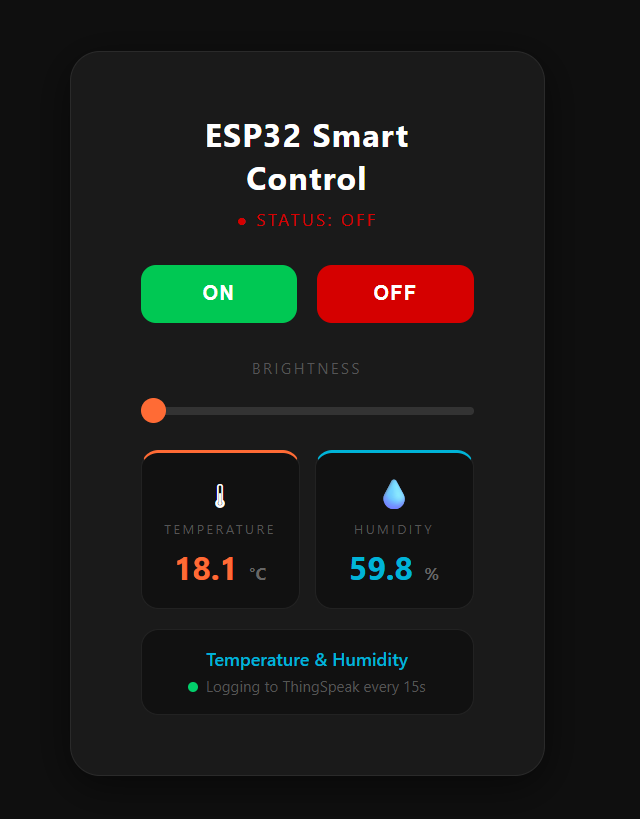
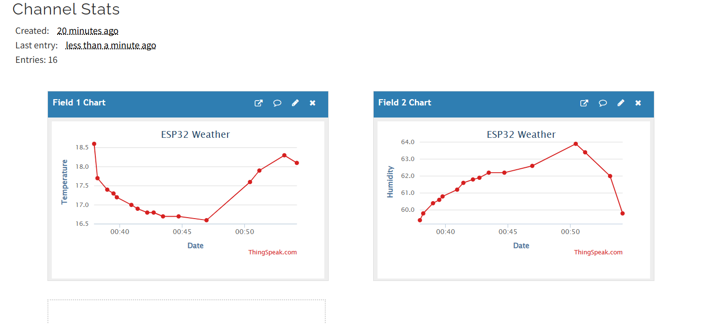
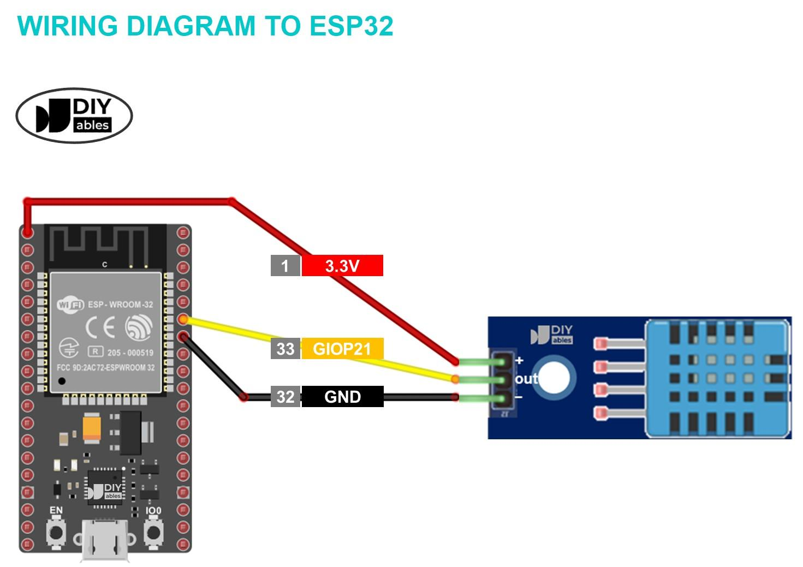

# 🚀 ESP32 Smart Home & IoT Dashboard

## 📌 Overview

An ESP32-based IoT system that enables real-time device control and environmental monitoring using a custom web interface and ThingSpeak cloud platform.

---

## ⚙️ Features

* 📱 Web-based control (ON/OFF + brightness)
* 🌡 Real-time temperature & humidity monitoring (DHT11)
* ☁️ Cloud data logging using ThingSpeak
* 📊 Live data visualization

---

## 🧰 Tech Stack

* ESP32
* Arduino IDE
* HTML/CSS/JS
* ThingSpeak

---

## 🔌 Hardware Used

* ESP32 Dev Board
* DHT11 Sensor
* LED

---

## 🚀 Future Improvements

* Relay-based appliance control
* Automation system
* Mobile app integration

## 📸 Screenshots

### Web Dashboard

### ThingSpeak Graph

### Circuit Diagram

